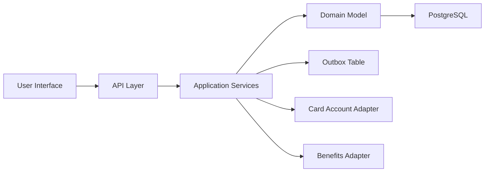
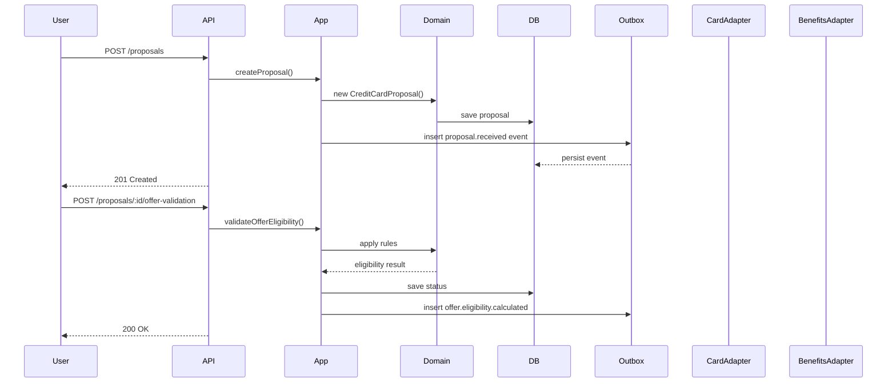
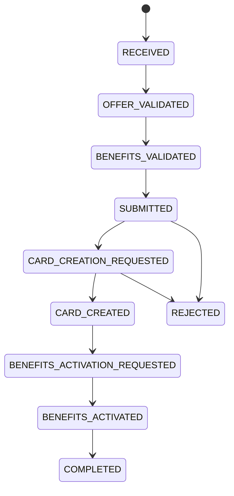
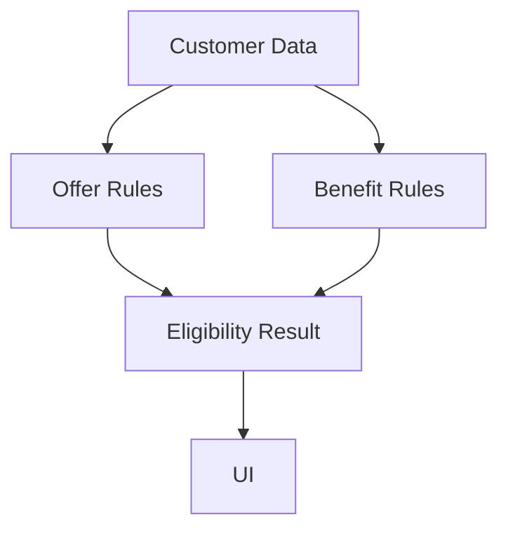

# Remaining Prompt Outputs

This document captures the prompt responses that were not yet executed directly in the codebase.

## 1. API REST Specification

### Base URL

`http://localhost:3000`

### Endpoints

- `POST /proposals`
  - Create a new credit card proposal.
  - Request: `CreateProposalDto`
  - Response: proposal summary and initial status.

- `POST /proposals/:proposalId/offer-validation`
  - Validate the selected offer eligibility.
  - Response: proposalId, status, and business result.

- `POST /proposals/:proposalId/benefits-validation`
  - Validate the selected benefits for the proposal.
  - Request: `ValidateBenefitsDto`
  - Response: proposalId, status, and selectedBenefits.

- `POST /proposals/:proposalId/submit`
  - Submit the proposal for processing.
  - Response: proposalId, status.

- `POST /proposals/:proposalId/card-creation`
  - Request card account creation for the proposal.
  - Response: proposalId, cardId, cardCreationStatus.

- `POST /proposals/:proposalId/benefits-activation`
  - Activate the eligible benefits for the proposal.
  - Response: proposalId, benefitActivationStatus.

- `GET /proposals/:proposalId/status`
  - Retrieve current proposal state.
  - Response: proposalId, status, cardCreationStatus, selectedBenefits, rejectionReason, cardId.

### Request DTOs

#### CreateProposalDto
- `proposalId: string`
- `customerProfile`
  - `fullName: string`
  - `nationalId: string`
  - `income: number`
  - `investments: number`
  - `currentAccountYears: number`
  - `email: string`
- `offerType: "A" | "B" | "C"`
- `selectedBenefits: BenefitType[]`

#### ValidateBenefitsDto
- `selectedBenefits: BenefitType[]`

### Response Format

- Successful responses return `200 OK` or `201 Created`.
- Business validation failures return `400 Bad Request` with a structured error body.
- Missing proposal returns `404 Not Found`.
- Server errors return `500 Internal Server Error`.

### Example Errors

- `Invalid input data` when DTO validation fails.
- `Offer not eligible` when the submitted offer does not meet financial rules.
- `Benefit selection invalid` when benefit rules are violated.
- `Proposal not found` for unknown proposalId.

### Correlation and Request Tracking

- The API should support request tracing via headers such as:
  - `X-Correlation-Id`
  - `X-Request-Id`
- Responses should echo the same correlation/request IDs.

## 2. Data Persistence Design

### Tables

#### proposals
- `id UUID PRIMARY KEY`
- `proposal_id VARCHAR UNIQUE`
- `full_name VARCHAR`
- `national_id VARCHAR`
- `income NUMERIC`
- `investments NUMERIC`
- `current_account_years NUMERIC`
- `email VARCHAR`
- `offer_type VARCHAR`
- `selected_benefits TEXT[]` or `simple-array`
- `benefit_activation_status JSONB`
- `status VARCHAR`
- `card_creation_status VARCHAR`
- `rejection_reason TEXT`
- `card_id VARCHAR`
- `audit_entries JSONB`
- `created_at TIMESTAMP`
- `updated_at TIMESTAMP`

#### proposal_status_history
- `id UUID PRIMARY KEY`
- `proposal_id UUID REFERENCES proposals(id)`
- `status VARCHAR`
- `changed_at TIMESTAMP`
- `reason TEXT`
- `metadata JSONB`

#### selected_benefits
- `id UUID PRIMARY KEY`
- `proposal_id UUID REFERENCES proposals(id)`
- `benefit_type VARCHAR`
- `created_at TIMESTAMP`

#### activated_benefits
- `id UUID PRIMARY KEY`
- `proposal_id UUID REFERENCES proposals(id)`
- `benefit_type VARCHAR`
- `activation_status VARCHAR`
- `activated_at TIMESTAMP`

#### audit_entries
- `id UUID PRIMARY KEY`
- `proposal_id UUID REFERENCES proposals(id)`
- `event VARCHAR`
- `timestamp TIMESTAMP`
- `detail TEXT`
- `actor VARCHAR`

#### outbox_events
- `id UUID PRIMARY KEY`
- `aggregate_id UUID`
- `event_type VARCHAR`
- `payload JSONB`
- `occurred_at TIMESTAMP`
- `processed_at TIMESTAMP NULL`
- `attempts INT`
- `status VARCHAR`

### Design Decisions

- Use PostgreSQL as the source of truth.
- Keep audit trail in `audit_entries` or embedded JSONB for fast retrieval.
- Use `proposal_status_history` for replayable state transitions.
- Use `outbox_events` for safe asynchronous integration.
- Sensitive fields such as `national_id` and `email` should be treated as PII.
- Mask or encrypt PII at rest when required by policy.

### Sensitive Data Strategy

- Encrypt `national_id` and `email` if stored in production.
- Do not log full `national_id`; log only last 4 digits if needed.
- Use application-level masking for UI and logs.

## 3. Event-Driven Design

### Domain Events

- `proposal.received`
- `offer.eligibility.calculated`
- `benefits.selection.validated`
- `proposal.submitted`
- `card.creation.requested`
- `card.created`
- `card.creation.failed`
- `benefits.activation.requested`
- `benefits.activated`
- `benefits.activation.failed`
- `proposal.completed`
- `proposal.rejected`

### Integration Events

- `proposal.validated`
- `customer.notified`

### Event Naming Convention

- Use dot-separated event names.
- Use past-tense verbs for completed actions.
- Include bounded context when useful, e.g. `card.creation.requested`.

### Event Payload Example

```json
{
  "proposalId": "proposal-1",
  "offerType": "A",
  "selectedBenefits": [],
  "status": "RECEIVED",
  "correlationId": "...",
  "occurredAt": "2026-04-16T00:00:00Z"
}
```

### Outbox Pattern

- Persist events in `outbox_events` inside the same transaction as domain updates.
- A separate worker reads unprocessed outbox rows and publishes them.
- Mark events as processed after successful publish.
- Retry on transient failures.

### Idempotency and Retry

- Use unique keys per domain event and message.
- Ensure event consumers can reprocess duplicates safely.
- Dead-letter events after a configured retry limit.

### Consumer Example

- Read pending events from `outbox_events`
- Publish to a broker or queue
- On success, set `processed_at`
- On failure, increment `attempts`
- If `attempts` exceeds threshold, mark as `FAILED`

## 4. Optional AI Assistance Layer

### Allowed Use Cases

- Explain why a proposal or benefit is eligible or rejected.
- Convert deterministic results into customer-friendly messages.
- Help operators inspect proposal history.

### Disallowed Use Cases

- Decision-making for eligibility.
- Generating or changing business rules.
- Approving or rejecting proposals.

### Architecture

- `AI Assistant Adapter` consumes structured domain output.
- `AI Assistant Service` enriches user-facing explanations.
- `AI Request` contains only deterministic data and context.
- `AI Response` returns natural-language guidance.

### Example Payload

**Input**
```json
{
  "proposalId": "proposal-1",
  "offerType": "A",
  "customerProfile": {
    "income": 2000,
    "investments": 1000,
    "currentAccountYears": 1
  },
  "selectedBenefits": ["CASHBACK"],
  "eligibilityResult": {
    "approved": true,
    "reasons": ["Income above threshold for Offer A"],
    "rejectedRules": []
  }
}
```

**Output**
```json
{
  "message": "Your selected offer A is eligible because your salary exceeds the minimum threshold. Cashback can be activated for this proposal.",
  "explanation": "Offer A requires income greater than 1000. The selected benefit Cashback is valid for this offer.",
  "source": "deterministic-engine"
}
```

### Guardrails

- Always attach source metadata: `source: deterministic-engine`.
- Do not expose raw customer PII in the prompt.
- Keep prompts deterministic and audited.

## 5. Mermaid Diagrams

### Architecture Diagram



### Sequence Diagram



### State Diagram



### Eligibility Flow



## 6. Security Strategy

### Data Protection

- Encrypt PII and financial data at rest when required.
- Use TLS for all HTTP traffic.
- Mask `nationalId` and `email` in logs.

### Input Validation

- Validate all incoming DTO fields.
- Enforce enum values for offers and benefits.
- Reject invalid JSON and malformed requests.

### Secrets Management

- Keep database credentials, encryption keys, and API secrets outside source control.
- Use environment variables or secret stores.

### Access Control

- Protect API endpoints with authentication and authorization.
- Apply role-based access if internal operator APIs exist.

### Replay and Idempotency

- Support idempotent operations on key commands such as proposal creation and submit.
- Track request IDs and ignore duplicate operations.

### Logging and Auditing

- Log business events, not raw sensitive data.
- Capture correlation IDs and trace IDs.
- Use audit entries for domain state changes.

### Recommended NestJS Middleware

- Global validation pipe.
- Logging interceptor that masks PII.
- Exception filter for consistent error responses.

## 7. Testing Strategy

### Coverage Areas

- Domain unit tests
- Eligibility engine tests
- Repository integration tests
- API endpoint tests
- Contract tests for adapters
- Idempotency tests
- Event processing tests

### Minimal Scenarios

1. Eligible customer for offer A with Cashback.
2. Eligible customer for offer B with VIP and Points.
3. Reject benefit selection when Cashback and Points are combined.
4. Reject travel insurance with offer A.
5. Reject proposal when user is not eligible for chosen offer.
6. Handle card creation failure.
7. Handle benefit activation failure after card creation.
8. Retry submit with the same idempotency key.

### Suggested Test Structure

- `test/domain/` for domain and policy unit tests.
- `test/application/` for use case tests.
- `test/infrastructure/` for repository integration tests.
- `test/interfaces/` for API tests.

### Example Jest Approach

- Use builders and fixtures for proposals.
- Mock external adapters for card account and benefits.
- Use in-memory DB or test Postgres for persistence tests.

## 8. Summary

The implementation now includes a working NestJS API with domain-driven models, eligibility rules, persistence, and a Dockerized runtime.

### AI Chat Assistant

A chat assistant is now available as a tool-driven interface.

- `POST /assistant/message` routes user requests to internal tools.
- The assistant can create proposals, validate offers, validate benefits, submit proposals, request card creation, activate benefits, and explain the current proposal state.
- The assistant is exposed through `POST /assistant/message`.
- When `OPENAI_API_KEY` is provided, the application uses a real OpenAI adapter for intent interpretation; otherwise it falls back to a local rule-based interpreter.
- The local fallback supports a guided flow: it can list available options, then ask for missing fields one by one, and execute the selected process once all required data is gathered.
- The `.env.example` now includes `OPENAI_API_KEY=` so the chat assistant can be enabled with a valid OpenAI API key.

This document completes the remaining prompt outputs for:

This document completes the remaining prompt outputs for:
- event-driven design
- optional AI assistant layer
- mermaid diagrams
- security strategy
- testing strategy
- enriched REST and persistence specification
