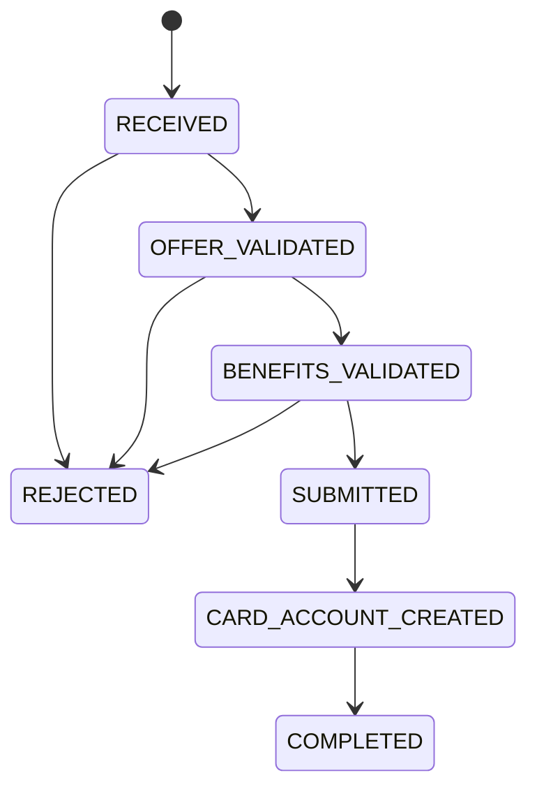
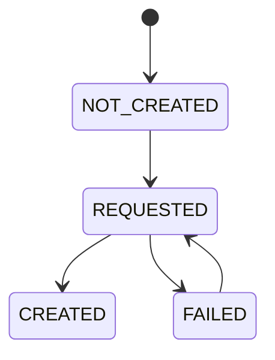

# Máquina de Estados da Proposta

Este documento descreve o estado de ciclo de vida armazenado em `proposal.status` e o estado operacional complementar armazenado em `proposal.cardCreationStatus`.

## Estado canônico de ciclo de vida

- `RECEIVED`
  A proposta foi criada e persistida.

- `OFFER_VALIDATED`
  A oferta selecionada foi validada com base no perfil do cliente.

- `BENEFITS_VALIDATED`
  Os benefícios escolhidos foram validados para a oferta selecionada.

- `SUBMITTED`
  A proposta está pronta para a criação da conta do cartão.

- `CARD_ACCOUNT_CREATED`
  A conta do cartão foi criada com sucesso e existe um `cardId`.

- `COMPLETED`
  A criação do cartão e a ativação de benefícios terminaram com sucesso.

- `REJECTED`
  A proposta falhou em uma validação de negócio.

## Estado complementar de criação do cartão

- `NOT_CREATED`
  A criação do cartão ainda não começou.

- `REQUESTED`
  A criação do cartão foi solicitada ao adapter downstream.

- `CREATED`
  A criação do cartão foi concluída com sucesso.

- `FAILED`
  A criação do cartão falhou por motivo técnico ou por falha downstream.

## Estado de ativação de benefícios

- `benefitActivationStatus`
  Guarda o resultado por benefício após a tentativa de ativação.

Possíveis valores atuais:

- `ACTIVATED`
- `FAILED`

## Transições de estado

## Progressão operacional

O fluxo de criação da conta do cartão é rastreado separadamente do ciclo de vida principal:

## Estados recuperáveis e terminais

Estados terminais de negócio:

- `REJECTED`
- `COMPLETED`

Estados operacionais recuperáveis:

- `SUBMITTED` com `cardCreationStatus = FAILED`
  A proposta segue aguardando novo retry técnico para criação do cartão.

- `CARD_ACCOUNT_CREATED` com algum item em `benefitActivationStatus = FAILED`
  A proposta ainda não foi concluída com sucesso total e exige novo tratamento operacional.

## Regras para manter o modelo coerente

- `status` é o ciclo de vida canônico visível ao usuário.
- `cardCreationStatus` é um detalhe operacional da integração de provisionamento do cartão.
- `benefitActivationStatus` detalha o resultado operacional da ativação por benefício.
- A validação da oferta só deve aprovar a proposta se o cliente for elegível para o `offerType` selecionado.
- A validação da oferta só pode ocorrer a partir de `RECEIVED`.
- A validação de benefícios só pode ocorrer a partir de `OFFER_VALIDATED`.
- Uma proposta só pode ser enviada a partir de `BENEFITS_VALIDATED`.
- A ativação de benefícios exige `cardCreationStatus = CREATED`.
- A criação de cartão pode ser reexecutada quando a proposta está em `SUBMITTED` e `cardCreationStatus = FAILED`.
- Cada transição deve registrar uma entrada de auditoria e emitir um evento de outbox quando aplicável.

## Modelo de eventos

Eventos recomendados para replay e observabilidade:

- `proposal.received`
- `offer.eligibility.calculated`
- `benefits.selection.validated`
- `proposal.submitted`
- `card.creation.requested`
- `card.created`
- `card.creation.failed`
- `benefits.activated`
- `proposal.completed`
- `proposal.rejected`
