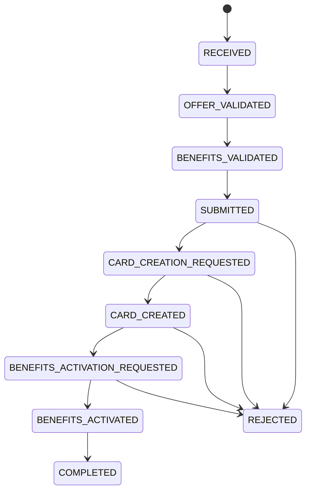

# Proposal State Machine

This document describes the main states of a credit card proposal and the transitions between them.

## States

- `RECEIVED`
  - Proposal has been created and stored.
  - No offer or benefit validation has yet occurred.

- `OFFER_VALIDATED`
  - The selected offer has been validated successfully.
  - The proposal is eligible for the chosen offer.

- `BENEFITS_VALIDATED`
  - Selected benefits have been validated against offer rules.
  - The proposal is ready to be submitted.

- `SUBMITTED`
  - The proposal has been submitted for processing.
  - This is the transition point to card creation.

- `CARD_CREATION_REQUESTED`
  - Card account creation has been requested.
  - A downstream integration or simulation is triggered.

- `CARD_CREATED`
  - A card account was successfully created.
  - A `cardId` is available.

- `BENEFITS_ACTIVATION_REQUESTED`
  - Benefit activation was requested after the card was created.

- `BENEFITS_ACTIVATED`
  - All eligible benefits have been activated.
  - The proposal is ready to complete.

- `COMPLETED`
  - The full origination flow finished successfully.

- `REJECTED`
  - The proposal was rejected at any stage.
  - `rejectionReason` should contain the reason.

## State Transitions

## Event-driven state model

For auditability and replay, every transition should emit a domain event.

Example events:

- `proposal.received`
- `offer.eligibility.calculated`
- `benefits.selection.validated`
- `proposal.submitted`
- `card.creation.requested`
- `card.created`
- `benefits.activation.requested`
- `benefits.activated`
- `proposal.completed`
- `proposal.rejected`

## Notes

- `RECEIVED` is the initial persistent state for a new proposal.
- `REJECTED` is terminal for failed business or technical flows.
- Each state transition should append an audit entry and optionally persist an outbox event.
- This state machine can be used to drive both API responses and internal orchestration.
